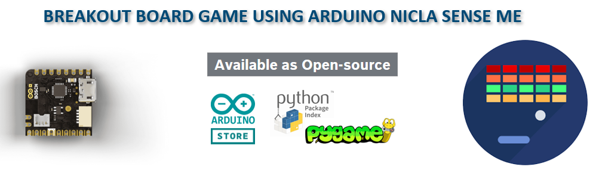

# Interfacing Nicla Sense ME with PyGame
Retro games created with PyGame where we use keyboard keys to play the game are interfaced with Nicla Sense ME board.
The accelerometer sensor data is used in playing the game instead of Keyboard inputs!

## [Arduino Nicla SENSE ME](https://www.bosch-sensortec.com/software-tools/tools/arduino-nicla-sense-me/)
Embedded in the Arduino-ecosystem, Nicla Sense ME features powerful Bosch Sensortec sensors.
Its an unique combination of highly integrated sensors on the board, including 9DoF smart motion and 4DoF environmental sensors with AI capabilities
The Ultra-compact, power-saving nature makes it suitable for rapid prototyping and deployment.

## [PyGame](https://www.pygame.org/docs/)

## STEPS TO PLAY THE GAME
### 1. Get Hands-ON a Nicla sense Arduino ME board,
This cool board has a tiny form factor and Bosch Senortec sensors!
Buy the hardware and use arduino IDE for programming and transmitting the sensor data via BLE
https://docs.arduino.cc/tutorials/nicla-sense-me/getting-started

### 2. Print your Game controller case (Optional)
Just for fun , but optional , print the game controller case with a 3D printer [Reference Design](Printed_Joy_stick/UM2E_Nicla_calssic_controller.gcode)

### 3. Run the game
Run the game by invoking [start_breakout_game.bat](breakout_game_nicla_sense_me/)
which inturn invokes 2 python scripts namely main.py and control.py

### 4. ENJOY THE GAME
Tilt the sensor and the paddle moves!

## GO WILD!
--------------------------------------------------------------------------------
Now you want to do something on your own, 
Think about trying the similar approach with any retro games like classic snake game, Asteroid game ...,

## And Oh Do Go Wild  and let me know!!
